<div align="center">

# 🤖 Agentic Code Analyzer

### *Multi-Agent AI System for Intelligent Code Analysis & Refactoring*

[](https://www.python.org/downloads/)
[](https://github.com/langchain-ai/langgraph)
[](https://ollama.ai/)
[](LICENSE)

*A production-grade demonstration of agentic AI architecture for software engineering*

[Features](#-key-features) • [Architecture](#-architecture) • [Installation](#-installation) • [Usage](#-usage) • [Tech Stack](#-tech-stack)

</div>

---

## 📋 Overview

**Agentic Code Analyzer** is a sophisticated, fully-local multi-agent system that performs comprehensive codebase analysis using coordinated AI agents. Built with **LangGraph** and powered by **Ollama**, it demonstrates advanced agentic AI patterns for real-world software engineering tasks.

Unlike traditional single-prompt AI tools, this system orchestrates **four specialized agents** that collaborate through a structured workflow to deliver deep, actionable insights into code quality, design patterns, and refactoring opportunities.

### 🎯 Why This Project Stands Out

- **🏗️ Production-Ready Architecture**: Implements industry-standard multi-agent patterns using LangGraph's state management
- **🔒 Privacy-First**: 100% local execution with no cloud dependencies or data leakage
- **🎓 Educational Value**: Demonstrates practical application of agentic AI, prompt engineering, and LLM orchestration
- **⚡ Performance Optimized**: Strategic model selection balancing accuracy, speed, and resource usage
- **🔧 Extensible Design**: MCP-compatible architecture ready for tool integration and scaling

---

## ✨ Key Features

| Feature | Description |
|---------|-------------|
| **Multi-Agent Workflow** | Four specialized agents (Planner, Analyzer, Fixer, Reviewer) working in sequence |
| **Local LLM Execution** | Runs entirely offline using Ollama - no API keys or cloud services required |
| **Smart Model Selection** | Each agent uses the optimal model for its task (DeepSeek R1, Qwen3 Coder, Llama 3.1) |
| **Interactive Analysis** | Runtime codebase selection with intelligent file filtering |
| **Structured State Management** | Type-safe agent communication using Pydantic schemas |
| **Docker Support** | Containerized deployment for reproducible environments |
| **Explainable Outputs** | Detailed reasoning at each stage with risk assessment and trade-off analysis |

---

## 🏛️ Architecture

### System Design

The system implements a **sequential agent pipeline** where each agent builds upon the previous agent's work:


### Agent Responsibilities

```mermaid
graph TD
    subgraph "🎯 Planner"
        P1[Define Analysis Scope]
        P2[Identify Key Files]
        P3[Set Priorities]
    end
    
    subgraph "🔍 Analyzer"
        A1[Read Source Files]
        A2[Identify Issues]
        A3[Detect Patterns]
    end
    
    subgraph "🔧 Fixer"
        F1[Propose Refactorings]
        F2[Generate Solutions]
        F3[Prioritize Changes]
    end
    
    subgraph "✅ Reviewer"
        R1[Validate Fixes]
        R2[Risk Assessment]
        R3[Trade-off Analysis]
    end
    
    P3 --> A1
    A3 --> F1
    F3 --> R1
```



### Model Selection Strategy

Each agent uses a carefully selected model optimized for its specific task:

| Agent | Model | Parameters | Rationale |
|-------|-------|-----------|-----------|
| **Planner** | `deepseek-r1:32b` | 32B | Superior reasoning and strategic planning capabilities |
| **Analyzer** | `qwen3-coder:30b` | 30B | Exceptional code comprehension and pattern recognition |
| **Fixer** | `qwen3-coder:30b` | 30B | Precise, conservative refactoring with code generation expertise |
| **Reviewer** | `llama3.1:8b` | 8B | Fast validation and sanity checks with good accuracy |

This specialization mirrors production AI systems where different models handle different cognitive loads.

---

## 🗂️ Project Structure

```
agentic-code-analyzer/
├── app/
│   ├── main.py              # Interactive CLI entry point
│   ├── graph.py             # LangGraph workflow orchestration
│   ├── llms.py              # Model configuration and initialization
│   ├── schemas.py           # Pydantic state schemas
│   │
│   ├── agents/              # Specialized agent implementations
│   │   ├── __init__.py
│   │   ├── planner.py       # Strategic planning agent
│   │   ├── analyzer.py      # Code inspection agent
│   │   ├── fixer.py         # Refactoring proposal agent
│   │   └── reviewer.py      # Validation and risk assessment agent
│   │
│   └── tools/               # Agent tooling
│       └── filesystem.py    # Controlled filesystem access
│
├── docker/
│   └── Dockerfile           # Container configuration
│
├── mcp/
│   └── filesystem_server.py # MCP server implementation (future)
│
├── docker-compose.yml       # Docker orchestration
├── requirements.txt         # Python dependencies
├── .env                     # Environment configuration
├── .gitignore
└── README.md
```

---

## 🚀 Installation

### Prerequisites

- **Python 3.10+** ([Download](https://www.python.org/downloads/))
- **Ollama** installed and running ([Installation Guide](https://ollama.ai/))
- **Required Models** pulled via Ollama:
  ```bash
  ollama pull deepseek-r1:32b
  ollama pull qwen3-coder:30b
  ollama pull llama3.1:8b
  ```

### Setup Steps

1. **Clone the repository**
   ```bash
   git clone https://github.com/<your-username>/agentic-code-analyzer.git
   cd agentic-code-analyzer
   ```

2. **Create virtual environment**
   ```bash
   python -m venv .venv
   
   # Windows
   .venv\Scripts\Activate.ps1
   
   # Linux/macOS
   source .venv/bin/activate
   ```

3. **Install dependencies**
   ```bash
   pip install -r requirements.txt
   ```

4. **Verify Ollama setup**
   ```bash
   ollama list
   ```
   Ensure all required models are available.

---

## 💻 Usage

### Running the Analyzer

```bash
python -m app.main
```

You'll be prompted to enter the path to the codebase you want to analyze:

```
Agentic Code Analyzer
---------------------
Enter the path to the codebase you want to analyze: 
```

**Example inputs:**
- `app` (relative path)
- `D:\Personal Project\some-project` (absolute path)
- `/home/user/projects/my-app` (Linux/macOS)

### Sample Output

The system will execute the full agent pipeline and display:

```
===== PLAN =====
[Strategic analysis plan with file priorities and focus areas]

===== ISSUES =====
[Detailed code issues with file locations and severity]

===== FIXES =====
[Concrete refactoring suggestions with code examples]

===== REVIEW =====
[Risk assessment, trade-offs, and implementation recommendations]
```

### Docker Deployment

Run the analyzer in a containerized environment:

```bash
docker compose up --build
```

**Note:** Ollama must be accessible from the container at:
```
http://host.docker.internal:11434
```

---

## 🛠️ Tech Stack

| Technology | Purpose |
|------------|---------|
| **[LangGraph](https://github.com/langchain-ai/langgraph)** | Multi-agent workflow orchestration and state management |
| **[LangChain](https://github.com/langchain-ai/langchain)** | LLM integration and prompt engineering |
| **[Ollama](https://ollama.ai/)** | Local LLM inference engine |
| **[Pydantic](https://docs.pydantic.dev/)** | Type-safe data validation and schemas |
| **Python 3.10+** | Core programming language |
| **Docker** | Containerization and deployment |

---

## 🎨 Design Principles

### 1. **Deterministic Behavior**
- Controlled filesystem access with explicit file filtering
- Reproducible results through temperature tuning
- Structured state management prevents agent drift

### 2. **Explainability First**
- Each agent provides detailed reasoning
- Risk and trade-off analysis for all suggestions
- Transparent decision-making process

### 3. **Performance Optimization**
- File type filtering and limits to control token usage
- Strategic model selection balancing speed and accuracy
- Efficient state sharing between agents

### 4. **Future-Proof Architecture**
- MCP-compatible design for remote tool integration
- Modular agent structure for easy extension
- Environment-based configuration for flexibility

---

## 🔮 Future Enhancements

- [ ] **CLI Arguments**: Command-line flags for path, file limits, and output format
- [ ] **Report Generation**: Export analysis as Markdown or JSON
- [ ] **Diff Output**: Generate git-style diffs for proposed changes
- [ ] **Confidence Scoring**: Quantify certainty of suggested fixes
- [ ] **Test Integration**: Automated test coverage and static analysis
- [ ] **IDE Plugin**: VSCode/JetBrains integration
- [ ] **MCP Tool Server**: Remote tool execution via Model Context Protocol
- [ ] **Streaming Output**: Real-time agent progress updates
- [ ] **Multi-Language Support**: Extend beyond Python to Java, TypeScript, etc.

---

## 📊 Performance Characteristics

| Metric | Value |
|--------|-------|
| **Average Analysis Time** | 2-5 minutes (depends on codebase size) |
| **Memory Usage** | ~8-16 GB (model-dependent) |
| **Token Efficiency** | ~10K-50K tokens per analysis |
| **Supported File Types** | `.py`, `.js`, `.ts`, `.java`, `.go`, `.rs`, etc. |

---

## 🤝 Contributing

Contributions are welcome! This project demonstrates advanced AI engineering patterns and is ideal for:

- Exploring multi-agent architectures
- Learning LangGraph and agentic workflows
- Experimenting with local LLM orchestration
- Building production-ready AI systems

---

## 📄 License

This project is licensed under the **MIT License** - see the [LICENSE](LICENSE) file for details.

---

## 🙏 Acknowledgments

- **LangChain Team** for the incredible LangGraph framework
- **Ollama** for making local LLM inference accessible
- **DeepSeek, Qwen, and Meta** for their powerful open-source models

---

<div align="center">

### 🌟 If this project helped you, please consider giving it a star!

**Built with ❤️ by a passionate AI engineer**

[Report Bug](https://github.com/<your-username>/agentic-code-analyzer/issues) • [Request Feature](https://github.com/<your-username>/agentic-code-analyzer/issues)

</div>
